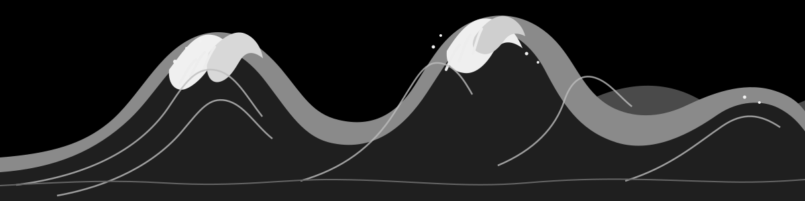

  

---

### About

I’m a computer science student interested in **probability, mathematics and systems**. I enjoy understanding how things work, then turning that understanding into code.

**Focus:** Probability · Mathematics · Algorithms · Systems

**Currently using:** C++ · C · Python · Git

**Contact:** [har1001sha@gmail.com](mailto:har1001sha@gmail.com)

### Stack

  

### GitHub

  
  

  

  building steadily. learning deeply.

  

  
  &nbsp;&nbsp;
  
  &nbsp;&nbsp;
  

